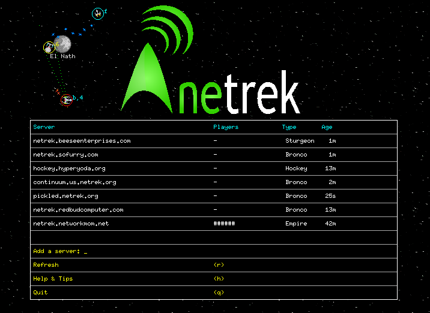
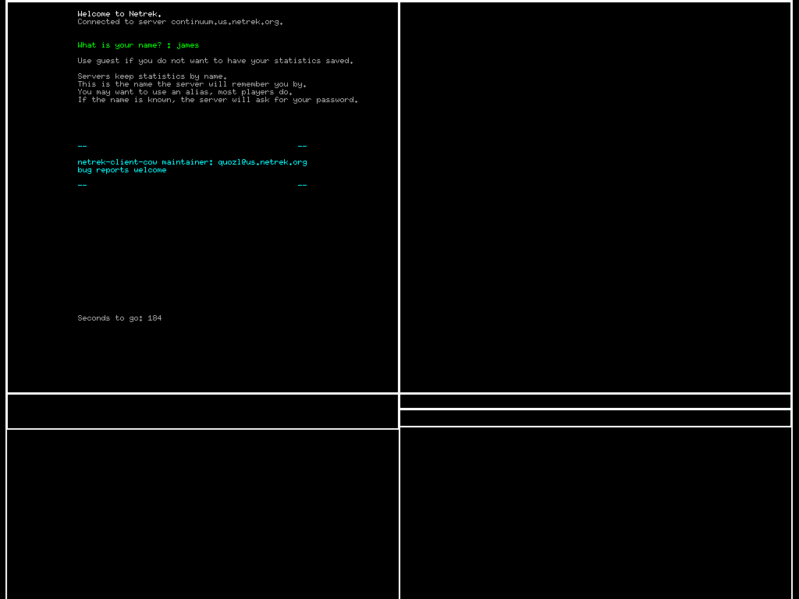
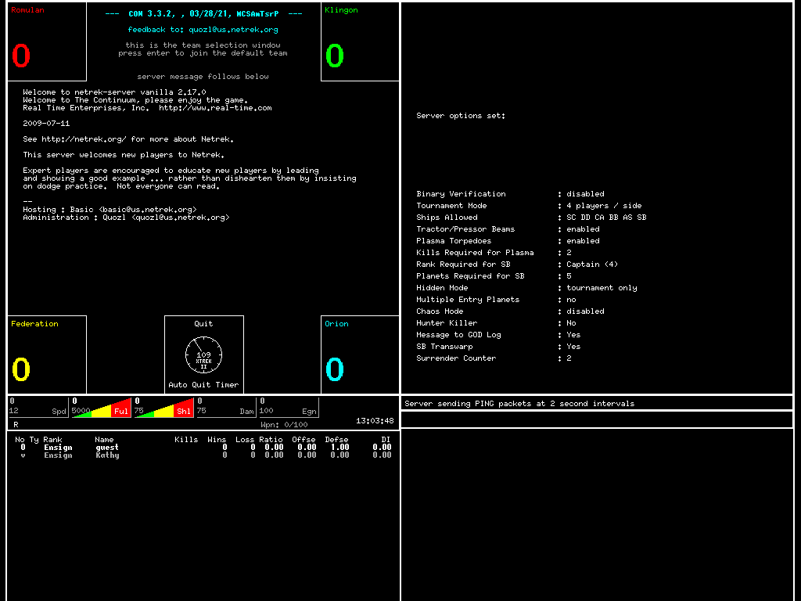

# Netrek Client COW

This is a client for the multi-player game of Netrek.

Netrek is probably the first video game which can accurately be
described as a "sport".  It has more in common with basketball than
with arcade games or Quake.  Its vast and expanding array of tactics
and strategies allows for many different play styles; the best
players are the ones who think fastest, not necessarily the ones who
twitch most effectively.  It can be enjoyed as a twitch game, since
the dogfighting system is extremely robust, but the things that
really set Netrek apart from other video games are the team and
strategic aspects.  Team play is dynamic and varied, with roles
constantly changing as the game state changes.  Strategic play is
explored in organized league games; after 6+ years of league play,
strategies are still being invented and refined.

The game was created in 1988, and still has players, including some
people who have been playing for nearly as long as the game has
existed.

## Get Started

On Debian or Ubuntu, install the package `netrek-client-cow`;

```
sudo apt install netrek-client-cow
```

Start the game;

```
netrek-client-cow
```

You will see the list of servers;



Mouse actions on the servers;

* left click, join with a server account,
* middle click, join as guest,
* right click, join as observer.

Keyboard keys.

* <kbd>r</kbd>, refresh the server list,
* <kbd>h</kbd>, show the help and tips,
* <kbd>q</kbd>, quit,

Mouse actions on the logo;

* left click, cycle through the action screenshots,

When you join a server, you may see this prompt;



Create an account by typing a name.  Most people use an alias.

After this, you will see team selection;



Most people join the second weakest team, in order to even things up.

Mouse actions on the team boxes;

* left click, join with default ship type,

Keyboard actions on the team boxes;

* <kbd>b</kbd> - join with a battleship,
* <kbd>c</kbd> - join with a cruiser, the default,
* <kbd>a</kbd> - join with an assault ship,
* <kbd>d</kbd> - join with a destroyer,
* <kbd>s</kbd> - join with a scout,
* <kbd>o</kbd> - join with a outpost, star base; requires rank and team capacituy,

After this, you will see your ship in the centre, with any other ships and planets nearby;


## Mouse

* left click, fire a torpedo toward the pointer,
* middle click, fire a phaser toward the pointer,
* right click, turn the ship toward the pointer,

## Keys

* <kbd>q</kbd> - self destruct and quit,
* <kbd>"</kbd> - toggle fullscreen mode,
* <kbd>h</kbd> - show help window,

## Frequently Asked Questions

### Lag when many ships nearby

Graphics load can exceed capacity.  The game does not detect this.

Try lowering the updates per second, either;

* <kbd>O</kbd>, then left click on the updates per second to reduce, or;
* add `updatespersec: 10` to a file `.netrekrc` in your home directory.

### Fullscreen mode is blank

Some displays cannot handle the resolution.  Press <kbd>"</kbd> again to turn off fullscreen mode.

### No sounds

No sounds are included.  A set of sounds has been available, but the copyright and license is unknown, so they are not in the source package.

If you can help with new sounds, please contact us.

## For developers

### Dependencies

Quick install;

```
sudo apt install libx11-dev libxt-dev libxxf86vm-dev \
    libimlib2-dev \
    libsdl-mixer1.2-dev libsdl1.2-dev \
```

* X11 client-side library is used for drawing on the display, input from keyboard and mouse,
* X11 XFree86 video mode extension library is used for changing display resolution,
* X11 toolkit intrinsics library is used by configure.ac, but not by the source,
* Imlib2 is used for reading PNG imagery and making screenshots,
* Simple DirectMedia Layer 1.2 is used for sounds, but sounds are not included in the source.

### Building

```
sh autogen.sh
./configure
make
```

